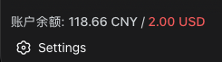

# dsh-deepseek-balance

一个常驻的 [DeepSeek Harness](https://github.com/deepseek-ai/deepseek-harness) Cordis 插件，用于在侧边栏底部、Settings 按钮正上方展示你的 DeepSeek 账户余额。

<p align="center">
  
</p>


> [!NOTE] 
> **AI 生成声明**:本插件由 AI 生成，可能存在错误、安全隐患或不符合预期之处，使用前请自行 review 代码并实测；发现任何问题欢迎提交 issue 或 PR 修正。

## 特性

- 在左侧边栏底部、Settings 上方展示当前 DeepSeek 账户余额，每 60 秒自动刷新。
- 支持 CNY 与 USD 两种货币显示，配置阈值以用颜色警告。
- 配置热加载 —— 编辑 `cordis.patch.yml` 或使用 设置 → 插件 → Balance Monitor；两者均无需重启 `dsh web` 即可生效。
- 当侧边栏收起（rail 模式）时自动隐藏。
- 从 `DEEPSEEK_API_KEY` 环境变量读取 API 密钥。

## 架构

| 端 | 文件 | 作用 |
| --- | --- | --- |
| Host | `lib/index.js` | 注册 `deepseek-balance` settings 命名空间（供 设置 → 插件 → Plugin configuration 标签页派发卡片）；注册 `/deepseek-balance`（代理 [DeepSeek Get User Balance API](https://api-docs.deepseek.com/api/get-user-balance)）和 `/deepseek-balance/settings`（GET 生效配置；POST 将设置保存/重置回 profile 的 `cordis.patch.yml` 中本插件所在行，启动时若该行不存在则写入默认配置） |
| Client | `lib/client.js` | 在 `sidebar.footer.action` 槽位注册余额展示（60 秒轮询），并以 `deepseek-balance` 为 key 在 `settings.plugin.item` 注册可编辑的 Balance Monitor 卡片（显示于 Plugin configuration 标签页） |

```
Browser (Client half)  --fetch /deepseek-balance-->  Host HTTP route  -->  api.deepseek.com/user/balance
```

## 安装

### 通过 [plugin-registry](https://github.com/vlln/plugin-registry) 安装

设置 → 插件 → 安装,source 填 `@choi-p/dsh-deepseek-balance` 或者 `github:Choi-Peng/dsh-deepseek-balance`

### 手动安装

1. 将插件安装到 web profile：
```bash
dsh plugin --profile web add "github:Choi-Peng/dsh-deepseek-balance"
```

2. 在 profile 的 patch 层挂载插件行：
```yaml
# ~/.dsh/profiles/web/cordis.patch.yml
- insert:
    - id: deepseek-balance
      name: '@choi-p/dsh-deepseek-balance'
      config:
        displayCurrency: cny
        warningThresholdCny: 0
        warningThresholdUsd: 0
```

### 卸载方式：

先从 cordis.patch.yml 移除该行（实时生效），然后：
```bash
dsh plugin --profile web remove @choi-p/dsh-deepseek-balance
```

## 配置

插件设置分层，**均实时生效，无需重启 `dsh web`**：

| 层 | 来源 | 生效方式 |
| --- | --- | --- |
| 默认值 | 代码内置（`cny`，两个阈值均为 0） | — |
| 主存储 | profile 的 `cordis.patch.yml` 中 `deepseek-balance` 行的 `config` —— **设置 → 插件 → Balance Monitor 的保存/重置会直接改写该行**（只替换该行的 `config` 块，文件中的注释、`!!js` 表达式与其他行原样保留；行文本无法识别时才整文件重写）；**插件启动时若 profile patch 中尚无本插件行，则自动追加一行默认配置** | `dsh web` 监听 patch 层（HMR）；写入后自动用新配置重启此 fiber，无需重启 |

卡片暴露
`displayCurrency`（下拉框）以及两个告警阈值（数字输入框），并提供
保存 / 恢复默认值；保存后，侧边栏余额展示会立即刷新（同时也会每 60 秒重新轮询一次）。

API 密钥按以下顺序解析：

1. `DEEPSEEK_API_KEY` 环境变量
2. `~/.api_keys` 文件 —— 形如 `export DEEPSEEK_API_KEY="sk-..."` 的行

余额 API 在存在时会同时返回 CNY 与 USD 余额；插件优先使用 CNY，缺省时回退到 USD。

## 开发

```bash
# 校验 host 半部分可被干净地导入：
node --input-type=module -e "import('@choi-p/dsh-deepseek-balance').then(m => console.log(m.name, m.inject))"

# 对 client bundle 做语法检查：
node -e "new Function(require('fs').readFileSync('lib/client.js', 'utf8'))"
```

## License

MIT
